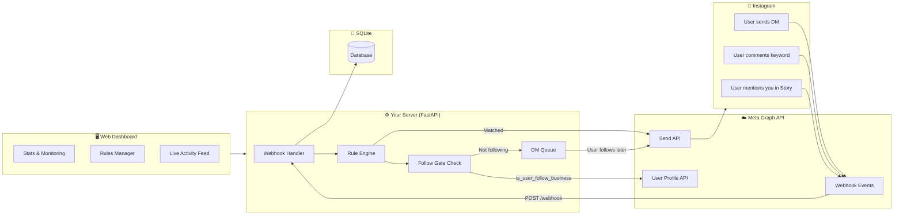

# Instagram Automation Tool — Official Meta Graph API

Build a self-hosted Instagram automation platform using the **official Meta Graph API** — the same API that ManyChat and Zaprep use. **Zero ban risk**, fully compliant, completely free.

> [!TIP]
> Since you have a Business/Creator account, we're using the **official API** instead of the risky `instagrapi` approach. This means Instagram will never flag or ban you — your automations are sanctioned by Meta.

## Architecture Overview



### How It Works (Event-Driven, Not Polling)

Unlike `instagrapi` which polls Instagram repeatedly (risky), the official API is **webhook-based**:

1. **User does something** (DMs you, comments a keyword, mentions you in a Story)
2. **Meta sends a webhook** to your server instantly
3. **Your server processes the event** → matches rules → sends a response via the Send API
4. **No polling, no scraping, no risk**

## Tech Stack

| Layer | Technology | Why |
|-------|-----------|-----|
| **Instagram API** | Meta Graph API v26.0 | Official, compliant, webhook-based, zero ban risk |
| **Backend** | FastAPI (Python) | Async-native, handles webhooks + serves dashboard |
| **Database** | SQLite (via SQLModel) | Zero-config, perfect for single-user self-hosted |
| **Tunnel (Dev)** | ngrok or Cloudflare Tunnel | Exposes local server to receive Meta webhooks |
| **Frontend** | Vanilla HTML/CSS/JS | Premium glassmorphism dashboard, no build tools |

## One-Time Setup Required (Meta Developer Portal)

> [!IMPORTANT]
> Before running the tool, you need to create a **Meta App** (free, ~15 minutes). Here's what's involved:

| Step | What | Time |
|------|------|------|
| 1 | Create a Meta Developer account at [developers.facebook.com](https://developers.facebook.com) | 2 min |
| 2 | Create a new App → select "Business" type | 2 min |
| 3 | Add "Messenger" and "Instagram Graph API" products to your app | 2 min |
| 4 | Link your Instagram Business/Creator account to a Facebook Page | 2 min (if not already done) |
| 5 | Generate a Page Access Token | 2 min |
| 6 | Configure Webhook URL (your server's public URL) | 3 min |
| 7 | Subscribe to `messages` and `comments` webhook fields | 2 min |

**For development/testing**: You can test with up to 25 users without App Review. For production (serving other accounts), you'd submit for App Review — but since this is **your own tool for your own account**, you likely won't need it.

I'll include a **step-by-step setup guide** inside the tool's settings page.

## Core Features

### 1. 💬 Auto-Reply to DMs (Keyword Triggers)
- User DMs you → webhook fires → your server checks for keyword matches → sends auto-reply
- Define keyword → response rules (e.g., "PRICE" → send price list message)
- Multiple keywords per rule, regex support
- Per-user cooldown (won't spam same person)
- 24-hour messaging window compliance (built-in)

### 2. 📢 Comment-to-DM Automation
- User comments a keyword on your post → webhook fires → your server sends a **private reply** DM
- Uses the official Private Reply API (`recipient.comment_id`)
- 7-day window to reply to a comment (API enforced)
- Track which users already received DMs (no duplicates)

### 3. 🚪 Follow Gate
- When keyword is triggered, check `is_user_follow_business` via the User Profile API
- If **following** → deliver content immediately
- If **not following** → send "follow me first!" message, queue the delivery
- When user follows + messages again → release queued DM
- Configurable per rule

### 4. 📖 Story Mention Auto-Reply
- User mentions you in their Story → webhook fires via `messaging` field
- Auto-send a thank-you DM or deliver content
- Follow gate applies here too

### 5. ❄️ Ice Breakers (Conversation Starters)
- Configure up to 4 FAQ buttons that appear when a user opens your DM
- Each button triggers a keyword rule automatically
- Set up via the Messenger Profile API

### 6. 📊 Premium Web Dashboard
- **Login page** with JWT authentication
- **Dashboard**: bot status, webhook health, stats (DMs sent, rules triggered, etc.)
- **Rules manager**: full CRUD with follow-gate toggle, cooldown settings
- **Activity log**: real-time SSE-powered feed of all actions
- **Settings**: Meta app config, webhook URL, token management
- **Setup wizard**: step-by-step guide for Meta App configuration
- Dark theme, glassmorphism, gradient accents, micro-animations

### 7. 🖥️ CLI Interface
- `python cli.py status` — server + webhook health
- `python cli.py rules list/add/remove` — manage rules
- `python cli.py logs` — tail activity logs
- `python cli.py setup` — interactive Meta App configuration

## Proposed Changes

### Project Structure

```
insta-auto/
├── requirements.txt              # Python dependencies
├── .env.example                  # Environment variable template
├── config.py                     # Configuration management
├── main.py                       # FastAPI app entry point
├── cli.py                        # CLI interface
│
├── core/
│   ├── __init__.py
│   ├── auth.py                   # JWT authentication for dashboard
│   ├── database.py               # SQLite setup via SQLModel
│   └── models.py                 # Database models
│
├── bot/
│   ├── __init__.py
│   ├── instagram.py              # Meta Graph API wrapper (send DM, check follow, etc.)
│   ├── webhook.py                # Webhook verification + event parsing
│   ├── rules.py                  # Rule engine (keyword matching, follow gate)
│   └── handlers.py               # Event handlers (message received, comment created, story mention)
│
├── api/
│   ├── __init__.py
│   ├── routes_auth.py            # Dashboard login/logout
│   ├── routes_webhook.py         # Meta webhook endpoint (GET verify + POST events)
│   ├── routes_rules.py           # CRUD for automation rules
│   ├── routes_logs.py            # Activity logs + SSE stream
│   └── routes_settings.py        # Settings + setup wizard data
│
└── frontend/
    ├── index.html                # Login page
    ├── dashboard.html            # Main dashboard
    ├── rules.html                # Rules management
    ├── logs.html                 # Activity logs
    ├── settings.html             # Settings + setup guide
    ├── css/
    │   └── style.css             # Premium dark theme
    └── js/
        ├── app.js                # Shared auth, navigation, utilities
        ├── dashboard.js          # Dashboard logic
        ├── rules.js              # Rules CRUD
        ├── logs.js               # SSE log streaming
        └── settings.js           # Settings management
```

---

### Backend — Core Infrastructure

#### [NEW] `requirements.txt`
`fastapi`, `uvicorn[standard]`, `sqlmodel`, `python-jose[cryptography]`, `passlib[bcrypt]`, `python-dotenv`, `pydantic-settings`, `httpx` (async HTTP for Graph API calls), `click` (CLI)

#### [NEW] `.env.example`
```env
# Meta App Configuration
META_APP_SECRET=your_app_secret
META_VERIFY_TOKEN=your_custom_verify_token
PAGE_ACCESS_TOKEN=your_page_access_token
INSTAGRAM_ACCOUNT_ID=your_ig_business_account_id

# Dashboard
DASHBOARD_PASSWORD=your_dashboard_password
JWT_SECRET=auto_generated_on_first_run

# Server
HOST=0.0.0.0
PORT=8000
```

#### [NEW] `config.py`
Centralized pydantic-settings config loaded from `.env`

#### [NEW] `core/database.py`
SQLite engine, session factory, auto-create tables on startup

#### [NEW] `core/models.py`
- `AutomationRule`: keywords (JSON list), response_text, response_media_url, follow_gate_enabled, cooldown_minutes, rule_type (dm/comment/story), is_active, created_at
- `ActionLog`: timestamp, event_type (dm_received/comment_received/story_mention/dm_sent/follow_gate_blocked), sender_id, sender_username, rule_id, status, details
- `QueuedDM`: sender_id, sender_username, rule_id, message_text, queued_at, delivered, delivered_at
- `AppSettings`: meta_app_secret, verify_token, page_access_token, ig_account_id (encrypted at rest)

#### [NEW] `core/auth.py`
JWT token creation/verification, password hashing, FastAPI dependency

---

### Backend — Bot Engine (Webhook + Graph API)

#### [NEW] `bot/webhook.py`
- `verify_webhook(request)` — handle Meta's `GET` verification challenge
- `validate_signature(payload, signature)` — HMAC-SHA256 validation of `X-Hub-Signature-256`
- `parse_event(payload)` — extract event type, sender ID, message text, comment ID, etc.

#### [NEW] `bot/instagram.py`
Meta Graph API wrapper using `httpx`:
- `send_message(recipient_id, text)` — `POST /{PAGE_ID}/messages`
- `send_private_reply(comment_id, text)` — `POST /{PAGE_ID}/messages` with `recipient.comment_id`
- `get_user_profile(scoped_id)` — `GET /{SCOPED_ID}?fields=name,username,is_user_follow_business`
- `set_ice_breakers(questions)` — `POST /me/messenger_profile`
- Error handling with retry logic for rate limits

#### [NEW] `bot/rules.py`
- `RuleEngine.match(text, rules)` — keyword and regex matching against active rules
- `RuleEngine.check_follow_gate(sender_id, rule)` — calls `get_user_profile`, returns follow status
- `RuleEngine.check_cooldown(sender_id, rule_id)` — per-user cooldown enforcement via DB lookup
- `RuleEngine.queue_dm(sender_id, rule)` — store queued DM for non-followers
- `RuleEngine.release_queued(sender_id)` — release queued DMs when user follows + messages again

#### [NEW] `bot/handlers.py`
Event handler functions called by webhook router:
- `handle_message(event)` — DM received → match rules → follow gate → send reply or queue
- `handle_comment(event)` — comment received → match keywords → send private reply DM
- `handle_story_mention(event)` — story mention → auto-thank DM
- All handlers log to `ActionLog`

---

### Backend — API Routes

#### [NEW] `api/routes_webhook.py`
- `GET /webhook` — Meta verification endpoint (returns `hub.challenge`)
- `POST /webhook` — receives all Instagram events, validates signature, dispatches to handlers

#### [NEW] `api/routes_auth.py`
- `POST /api/auth/login` — dashboard login → returns JWT
- `GET /api/auth/me` — verify token validity

#### [NEW] `api/routes_rules.py`
- `GET /api/rules` — list all rules
- `POST /api/rules` — create rule
- `PUT /api/rules/{id}` — update rule
- `DELETE /api/rules/{id}` — delete rule

#### [NEW] `api/routes_logs.py`
- `GET /api/logs` — paginated action history
- `GET /api/logs/stream` — SSE endpoint for real-time activity
- `GET /api/stats` — aggregated stats (DMs sent today, rules triggered, etc.)

#### [NEW] `api/routes_settings.py`
- `GET /api/settings` — current config (tokens masked)
- `PUT /api/settings` — update Meta app credentials
- `GET /api/settings/webhook-status` — test webhook connectivity
- `POST /api/settings/ice-breakers` — configure ice breaker questions

#### [NEW] `main.py`
- FastAPI app with CORS, static file serving for frontend
- Mount all routers, startup DB init
- Serve frontend from `/` via `StaticFiles`

---

### Frontend — Premium Dashboard

#### [NEW] `frontend/css/style.css`
- Deep dark theme (charcoal `#0f0f1a` to navy `#1a1a2e` gradients)
- Glassmorphism cards (`backdrop-filter: blur(20px)`, subtle borders)
- Neon cyan-to-purple gradient accents for buttons and active states
- Google Font: Inter for clean typography
- Smooth micro-animations: fade-in on load, hover scale on cards, pulse on status indicator
- Custom toggle switches, styled inputs, responsive grid
- Mobile-responsive for managing from phone

#### [NEW] `frontend/index.html` — Login
- Full-viewport animated gradient background
- Centered glassmorphism login card
- Instagram-style branding

#### [NEW] `frontend/dashboard.html` — Main Dashboard
- Top bar: account name, webhook health indicator (green pulse = connected)
- Stat cards row: DMs Sent Today, Rules Active, Comments Processed, Story Mentions
- Recent Activity feed (last 20 actions, auto-updates via SSE)
- Quick-add rule button

#### [NEW] `frontend/rules.html` — Rules Manager
- Rules table with columns: Keywords, Response, Type (DM/Comment/Story), Follow Gate toggle, Status toggle
- Add/Edit rule modal: keyword input (tags-style), response textarea, type dropdown, follow gate checkbox, cooldown slider
- Delete with confirmation
- Empty state illustration

#### [NEW] `frontend/logs.html` — Activity Logs
- Real-time scrolling log powered by SSE
- Filter pills: All, DMs, Comments, Story Mentions, Follow Gates
- Each entry: timestamp, event icon, username, action, status badge

#### [NEW] `frontend/settings.html` — Settings & Setup
- Setup wizard accordion (step-by-step Meta App guide with screenshots)
- Credentials form: App Secret, Verify Token, Page Access Token, IG Account ID
- Webhook URL display + copy button + health check button
- Ice Breaker configuration (up to 4 questions)

---

### CLI Interface

#### [NEW] `cli.py`
Click-based CLI:
- `python cli.py status` — show server status + webhook health
- `python cli.py rules list` — display all rules in a table
- `python cli.py rules add` — interactive rule creation
- `python cli.py rules remove <id>` — delete a rule
- `python cli.py logs` — stream recent logs
- `python cli.py setup` — interactive `.env` setup wizard

## Comparison: This Tool vs. ManyChat

| Feature | ManyChat (Paid) | Your Tool (Free) |
|---------|----------------|-------------------|
| Comment-to-DM | ✅ $15/month | ✅ Free |
| Auto-reply to DMs | ✅ $15/month | ✅ Free |
| Follow Gate | ✅ $15/month | ✅ Free |
| Story Mention Reply | ✅ $15/month | ✅ Free |
| Ice Breakers | ✅ $15/month | ✅ Free |
| Web Dashboard | ✅ Cloud-hosted | ✅ Self-hosted |
| Ban Risk | None (official API) | None (official API) |
| Data Privacy | Their servers | **Your server** |
| Unlimited Messages | Pro plan only | ✅ Unlimited |
| Custom Logic | Limited | ✅ Full control |

## Verification Plan

### Automated Tests
```bash
# Install dependencies
pip install -r requirements.txt

# Copy and configure environment
copy .env.example .env
# Edit .env with your Meta App credentials

# Start the server
python main.py

# Verify API is running
curl http://localhost:8000/api/stats
curl http://localhost:8000/docs

# Start ngrok tunnel (for webhook)
ngrok http 8000
# Copy the HTTPS URL → paste into Meta App Dashboard as webhook URL
```

### Manual Verification
1. Open `http://localhost:8000` → verify login page renders with premium dark theme
2. Login → verify dashboard shows stats and webhook health
3. Create a keyword rule (e.g., keyword "GUIDE", response "Here's your guide: [link]")
4. From another Instagram account, DM the keyword → verify auto-reply fires
5. Comment the keyword on a post → verify private reply DM is sent
6. Test follow gate with a non-follower → verify "follow first" message
7. Mention the account in a Story → verify thank-you DM

## Open Questions

1. **Deployment preference** — Will you run this on your local machine (with ngrok) or on a VPS/cloud server? This affects how I handle the webhook URL configuration.

2. **Story mention responses** — Do you want the same keyword-based rules for story mentions, or just a single "thank you for the mention!" auto-reply?

3. **Multi-step conversations** — Do you want simple single-reply rules, or do you want a basic conversation flow (e.g., user says "PRICE" → bot asks "Which product?" → user picks → bot sends price)? Starting simple is recommended, but I want to know your end goal.
